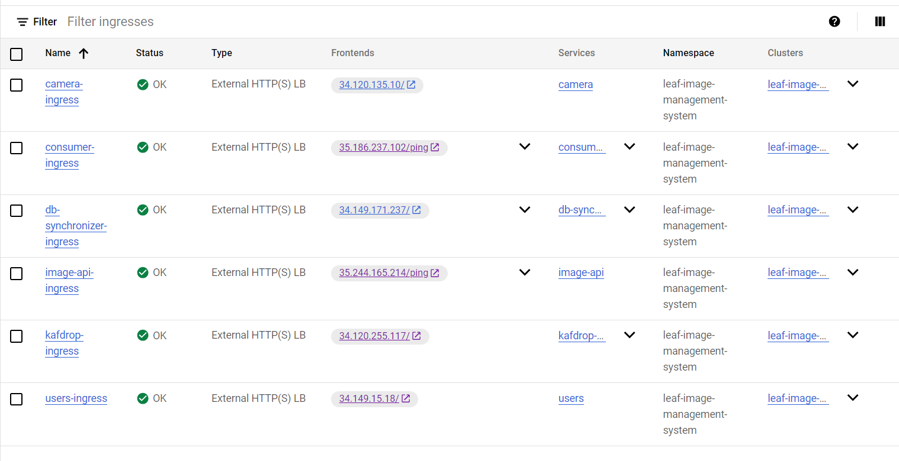

# Implementation process

This project involves the implementation of a new service, the Consumer, which aims to synchronize data between two databases using a stream-based approach.
The service will consume at least one topic from the Kafka cluster, creating, updating, or deleting information in the consumer_plant_db.

The primary goal of this project was to deploy the service locally and on the GCP, utilizing corresponding .yaml files, and conduct a bandwidth comparison experiment. This experiment evaluated the efficiency of the current Db Synchronizer Job, which operates every 600 seconds, against the proposed stream-based solution, with monitoring facilitated through Grafana.

**Project Setup:**
The project began by pulling essential Docker images from Docker Hub, namely "image_api," "image_analyzer_api," "users_job," "camera_job," "leaf_disease_recognizer_job,", "db_synchronizer_job," "producer_plant_db,", "consumer_plant_db," "zookeeper,"and "kafka." Additionally, a consumer service was developed locally using FastAPI.

**Consumer implementation**

I chosed to build the Consumer service using FastAPI, a tool that helps create web APIs easily. To keep things organized, I used a virtual environment.

- To install virtual environment

```
py -3 -m venv <virtual_machine_name>
```

- To activate virtual machine

```
your_virtual_environment_name\Scripts\activate.bat
```

- To install FastAPI

```
pip install fastapi
```

- To start the FastAPI application using uvicorn:

```
uvicorn your_file_name:app --reload
```

- After initiating the server, I accessed the FastAPI application by navigating to the default http://127.0.0.1:8000 provided by uvicorn.
- The command `pip freeze > requirements.txt` is used to generate a “requirements.txt” file that contains a list of all installed Python packages along with their versions.

- The implementation of the Consumer mirrors the image-api, using identical schemas and sharing common endpoints.

# Detailed APIs’ Description (Consumer)

This service includes an API with the following endpoints.

- ## Ping the service’s status.

  Request has no attributes. It's a simple request to check the status or health of the service.

  ```http
  [GET] /ping
  ```

  Response provides the following information if the service is operational (content type: application/json):

  ```json
  "Hello, I am alive"
  ```

  This response returns a 200 status code if the operation was successful, and a 4xx status code otherwise.

- ## Get a potato/tomato/pepper image with metadata by id.

  Request has a consistent structure for all three handlers and only requires the image’s id, where ids are sequential starting from 1:

  ```http
      [GET] /image-plant/potato/{image_id}
      [GET] /image-plant/tomato/{image_id}
      [GET] /image-plant/pepper/{image_id}
  ```

  Example:

  ```http
      [GET] /image-plant/potato/1
  ```

  Response also maintains a consistent structure for these three handlers.

  ```json
    {
        "id": 1,
        "camera_id": 1,
        "data": "ffd8ffe000104a46...", (encoded-image-data)
        "gps_coordinates": [
          48.476563,
          16.585654
        ],
        "created_at": "2023-10-08T15:39:49.123123",
        "updated_at": "2023-10-08T15:39:49.123123",
        "is_active": false,
        "is_deleted": false,
        "disease": null,
        "percentage": null
    }
  ```

  This response returns a 200 status code if the operation was successful, and
  a 4xx status code otherwise.

- ## Get the total count of potato/tomato/pepper images.

  Request has a consistent structure for all three handlers and does not require any data for transfer:

  ```http
    [GET] /image-plant/potato/total/
    [GET] /image-plant/tomato/total/
    [GET] /image-plant/pepper/total/
  ```

  Response maintains a similar structure for all three handlers (content type: application/json):

  ```json
  {
    "total_images": 2157
  }
  ```

- ## Create a potato/tomato/pepper image.

  Request includes the following parameters:

  - `camera_id`
  - `gps_coordinates`

  These parameters apply to all three endpoints:

  ```http
    [PUT] /image-plant/potato/
    [PUT] /image-plant/tomato/
    [PUT] /image-plant/pepper/
  ```

  Example:

  ```json
  {
    "camera_id": 1,
    "gps_coordinates": [48.476563, 16.585654]
  }
  ```

  Response maintains a consistent structure for these three endpoints (content type: application/json)

  ```json
    {
        "id": 2158,
        "camera_id": 1,
        "data": "ffd8ffe000104a4...", (encoded-image-data)
        "gps_coordinates": [48.476563, 16.585654],
        "created_at": "2023-10-09T18:43:37.500688",
        "updated_at": "2023-10-09T18:43:37.500692",
        "is_active": false,
        "is_deleted": false,
        "disease": null,
        "percentage": null
    }
  ```

- ## Update a potato/tomato/pepper image.

  Request maintains a consistent structure for all three endpoints and includes the following parameters:

  - `id`
  - `camera_id`
  - `gps_coordinates`
  - `disease`
  - `percentage`
  - `is_active`
  - `is_deleted`

  These parameters apply to all three endpoints:

  ```http
    [POST] /image-plant/potato/
    [POST] /image-plant/tomato/
    [POST] /image-plant/pepper/
  ```

  Example:

  ```json
  {
    "id": 1,
    "camera_id": 1,
    "gps_coordinates": [48.476563, 16.585654],
    "disease": "Healthy",
    "percentage": 0.995,
    "is_active": true,
    "is_deleted": false
  }
  ```

  The response for this operation returns a 200 status code if successful, and a 4xx status code otherwise.

- ## Delete a potato/tomato/pepper image by id.

  Request has a consistent structure for all three handlers and requires only the image’s id, with ids being sequential starting from 1:

  ```http
    [DELETE] /image-plant/potato/{image_id}
    [DELETE] /image-plant/tomato/{image_id}
    [DELETE] /image-plant/pepper/{image_id}
  ```

  Example:

  ```http
  [DELETE] /image-plant/potato/1
  ```

  Response also maintains a consistent structure for these three endpoints (content type: application/json):

  ```json
  {
    "message": "Image deleted successfully"
  }
  ```

  This response returns a 200 status code if the operation was successful, and a 4xx status code otherwise.

## scalability and bottlenecks

Consumer service is designed with scalability in mind, capable of horizontal scaling to accommodate changing demands by increasing no of pods in kubernetes. An increase in dataflow intensity or photo modifications in the Kafka cluster would require horizontal scaling by adding more nodes to handle the higher throughput which is done automatically by kubernetes. Stream-processing is preferred for real-time updates, providing lower latency compared to batch processing. Scaling on GKE involves dynamic resource allocation, leveraging Kubernetes' auto-scaling features for efficient utilization and cost-effectiveness.

# Challenge(s) Faced During Implementation

During the development of the consumer service and attempts to establish a connection with Kafka, I encountered an issue, when trying to connect without creating a consumer image or container. The initial attempt involved using the following properties in the kafka.dev.json config file:

```json
{
  "bootstrap.servers": "localhost:9093",
  "group.id": "pepper-potato-tomato-group",
  "enable.auto.commit": "false",
  "auto.offset.reset": "earliest",
  "client.id": "my-consumer-service"
}
```

However, this resulted in an error message:

**kafka-service.leaf-image-management-system.svc.cluster.local:9092: Name or service not known. Name or service couldn't resolved.**

The issue was resolved by creating a consumer Docker container and providing the following kafka.stg.json config file:

```json
{
  "bootstrap.servers": "kafka-service.leaf-image-management-system.svc.cluster.local:9092",
  "group.id": "pepper-potato-tomato-group",
  "client.id": "image-consumer",
  "auto.offset.reset": "earliest"
}
```

#### Issue: Threading in the python program:

Encountered concurrency challenges in a Python FastAPI project due to single-threaded operations for DB connection, Kafka consumption, and main app logic. Addressed the issue by implementing distinct threads for each task, mitigating bottlenecks and optimizing performance

**Local Development using Docker Desktop:**

1. **Local Consumer Service:** The consumer service was implemented locally in FastAPI, providing a mechanism for consuming data from kafka broker and forwarding to consumer_plant_db.

2. **Testing Locally:** The consumer service's functionality was verified through the execution of API calls.

3. **Dockerfile Creation:** A Dockerfile was created to containerize the consumer service, facilitating easy deployment across different environments.

4. **Docker-Compose Configuration:** A docker-compose file was created to define and orchestrate the containers for all services, streamlining the local development process.

5. **End-to-End Testing:** Docker Desktop was used to have visualisation of services and to manage images, containers, ports, and logs ensuring a comprehensive evaluation of the entire system.

**Local Kubernetes Integration:**

1. **Kubernetes Setup Excluding the Consumer Service:**
   The project was cloned using the following URL: [cc_assignment_2](https://github.com/AndrewAlscher/cc_assignment_2.git), and the instructions for `local deployment` specified in the README.md file were followed.

2. **Deployment and Service Creation for Consumer Service:**

   - Deployment and service configurations have been defined in consumer-deploy.stg.yaml, consumer-service.stg.yaml in "leaf-image-management-system" namespace

   Similar to other services, I created:

   - `start.stg.sh` to deploy the consumer service locally.
   - `open.stg.sh` to expose the port of the consumer service.
   - `close.stg.sh` to close the port when needed.

   Kubernetes manifest files for production and staging are located at directory:

   - consumer /prod /..
   - consumer /stg /..

# GCP Screenshots

- gcp cluster
  

- connection via terminal
  

- Laod balancer and protocols
  

- deployed pods
  

- deployed ingress
  

- cluster deleted
- 

# Problems Encountered:

#### Issue 1: Incorrect Dockumentation for `/is-deployed` Endpoint.

The documentation incorrectly states that the endpoint for checking if the producer database is deployed is `[GET] /is-deployed`. However, the actual endpoint should be `[GET] /image-plant/is-deployed/`. This inconsistency caused significant confusion for me, as it took over 3 hours to identify the correct endpoint by inspecting the program's source code.

#### Issue 2: Unable to Resolve Service Names in Docker Compose with config file.

When attempting to use the configuration file from the development environment in the `docker-compose.yaml` file, I encountered the following error messages:

```
mongodb-consumer.leaf-image-management-system.svc.cluster.local:27017: Name or service not known.
mongodb-producer.leaf-image-management-system.svc.cluster.local : Name or service not known.
image-api.leaf-image-management-system.svc.cluster.local: Name or service not known.
image-analyzer-api.leaf-image-management-system.svc.cluster.local: Name or service not known.
kafka-service.leaf-image-management-system.svc.cluster.local:9092: Name or service not known.
```

The issue was successfully resolved by using the long names as container names directly in the `docker-compose.yaml` file. This ensures that the services can be correctly identified and addressed within the Docker Compose setup. By specifying the full container names, the error related to name or service not known is eliminated, allowing for proper communication and connectivity between the different services in the Docker environment.

## Unresolved Challenges

I was unable to complete the task, which involved comparing the bandwidth between the pre-implemented batch processing application and the stream processing implementation. The goal was to connect to Grafana, either locally or on the cloud.and interface with the pre-installed Prometheus servers of the LIMS for streaming data, as well as with the DB Synchronizer Job for batch processing.Unfortunately, I couldn't fulfill these requirements.

The service is located on my GitHub repository [GitHub](https://github.com/sus20/CC_A2.git)

### Reference

1. Avasthi, T., & Avasthi, T. (2023, November 6). _Guide to setting up Apache Kafka using Docker | Baeldung on Ops_. Baeldung on Ops. https://www.baeldung.com/ops/kafka-docker-setup

2. _Apache Kafka Python Client | Confluent Documentation_. https://docs.confluent.io/kafka-clients/python/current/overview.html

3. OpenAI. https://www.openai.com/
